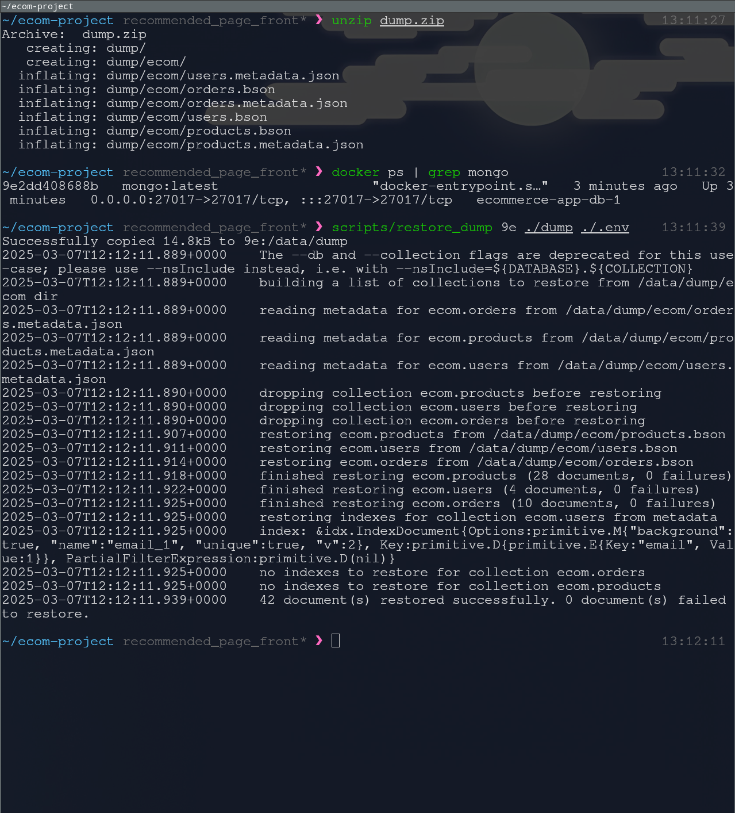

# App and Web Development Module Assignment

This repository contains the code for the App and Web Development Module
Assignment, which is a simple full-stack E-commerce Web App. The provided
`docker-compose.yaml` file allows users to easily set up and run the entire
application stack using Docker Compose. More detailed review will be provided in
the submitted report of this assignment.

## Table of Contents

- [Services Summary](#services)
- [Getting Started](#start)
  - [Prerequisites](#pre)
  - [Build and Run](#install)
  - [Restore Dump](#restore-dump)
     - [Troubleshooting](README#Troubleshooting)
  - [Run the tests](#run-the-tests)
- [License](#license)

## Serivces

1. `database` - MongoDB for handling data storage.
2. `backend` - Application Server on Express.js.
3. `frontend` - An SPA written on Angular.js.
4. `webserver` - A Reverse Proxy (NGINX).
5. `cache` - A simple Redis cache service.
6. `recommend` - A recommendation system service (Express.js).

## Getting Started<a name="start"></a>

To get started with running the application, follow these instructions:

### Prerequisites<a name="pre"></a>

The following software needs to be installed on your machine:

- Node.js
- Docker
- Docker Compose

You can use this links for detailed installation instructions:

- [How to install Node.js](https://nodejs.org/en/learn/getting-started/how-to-install-nodejs)
- [Get Docker](https://docs.docker.com/get-docker/)
- [Install Docker Engine](https://docs.docker.com/engine/install/)
- [Install Docker Compose](https://docs.docker.com/compose/install/)

### Build and Run<a name="install"></a>

1. Clone this repository to your local machine:

   ```bash
   git clone https://github.com/SerhiiYahdzhyiev/app-n-web-dev-assignment.git
   ```

2. Navigate into the project directory:

   ```bash
   cd app-n-web-dev-assignment

   ```
3. Prepare `.env` file:

   ```bash
   cp .env.example .env
   ```


4. Build and start the Docker containers:

   ```bash
   docker-compose up -d --build
   ```

   *!!! May take a while.*

   If you have UNIX OS with `make` feel free to use provided `Makefiles`:
      - `make up` to build and start all services
      - `make down` to stop and remove containers (services)
      - `make <service_name>` to build and start individual service

   You can use the same commands for launching dev setup, by explicitly specifying
   `Makefile.dev` as a target `Makefile`.

5. Once the containers are up and running, you can access the Angular SPA at
   `http://localhost/`.

   You can enter the admin page with
   default credentials:

   ```
   admin@mail.com
   root
   ```

#### Troubleshooting

There are possible failures in container starts for `webserver` and `backend`
services. If you face issues like `Bad Gateway` responses, inspect running
containers with `docker ps -a`, and try to re-start failed services:

```bash
docker-compose up -d --build <service_name>
```

### Restore Dump

This is completely optional.

The dump included in this repo has slightly more users, and some mock orders.
It was made primarily for the evaluators of on of the university assignments
related to integration of recommendation system into initial minimalistic
e-commerce platform.

In order to restore the db from `dump.zip`:

1. Unpack the `dump.zip` archive into project's root directory.

   *Linux Example using unzip:*
   ```bash
   unzip dump.zip
   ```

2. Run the `restore_dump` script from `sctipts` subdirectory.

   **Important:** The script should be run from this project's root directory.

   To see the usage of the script simply run it with no arguments.

   The next screenshot aims to demonstrate an overview of the whole process:

   

### Run the tests

1. In the project root checkout `testing` branch:
   ```bash
   git fetch --all
   git switch testing
   git pull
   ```

2. Navigate to the `back` folder.
   ```bash
   cd back
   ```

3. Install dependencies:
   ```bash
   npm install
   ```

4. Run test script:
   ```bash
   npm run test
   ```

## License<a name="license"></a>

This project is licensed under the [MIT License](LICENSE.md).
